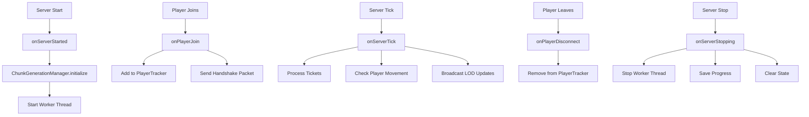

## Overview

Voxy World Gen V2 uses [Fabric API's event system](https://fabricmc.net/wiki/tutorial:events) to hook into the server lifecycle. The `ServerEventHandler` class provides centralized event handling that coordinates:

- Server startup and shutdown
- Player connection management  
- Periodic tick processing
- Integration with `ChunkGenerationManager`

## Event Handler Registration

All events are registered in the main mod initializer (`VoxyWorldGenV2.java`):

```java
ServerLifecycleEvents.SERVER_STARTED.register(ServerEventHandler::onServerStarted);
ServerLifecycleEvents.SERVER_STOPPING.register(ServerEventHandler::onServerStopping);
ServerPlayConnectionEvents.JOIN.register(ServerEventHandler::onPlayerJoin);
ServerPlayConnectionEvents.DISCONNECT.register(ServerEventHandler::onPlayerDisconnect);
ServerTickEvents.END_SERVER_TICK.register(ServerEventHandler::onServerTick);
```

## Event Handlers

### onServerStarted

**Event**: `ServerLifecycleEvents.SERVER_STARTED`  
**When**: After the server finishes starting up and is ready to accept players

```java
public static void onServerStarted(MinecraftServer server) {
    VoxyWorldGenV2.LOGGER.info("server started, initializing manager");
    ChunkGenerationManager.getInstance().initialize(server);
}
```

**What it does:**
1. Logs server startup
2. Initializes the `ChunkGenerationManager` singleton with the server instance
3. Starts the background worker thread for chunk generation
4. Loads configuration from disk
5. Sets up the generation throttle (semaphore)

**Downstream effects:**
- `ChunkGenerationManager.initialize()` /workspace/source/src/main/java/com/ethan/voxyworldgenv2/core/ChunkGenerationManager.java:103
  - Creates worker thread
  - Loads `Config.DATA`
  - Initializes throttle with `maxActiveTasks` permits

<Info>
The mod will not generate any chunks until this event fires. Early-phase generation is not supported.
</Info>

---

### onServerStopping

**Event**: `ServerLifecycleEvents.SERVER_STOPPING`  
**When**: Before the server begins its shutdown sequence

```java
public static void onServerStopping(MinecraftServer server) {
    VoxyWorldGenV2.LOGGER.info("server stopping, shutting down manager");
    ChunkGenerationManager.getInstance().shutdown();
    PlayerTracker.getInstance().clear();
}
```

**What it does:**
1. Logs server shutdown
2. Gracefully stops the `ChunkGenerationManager`:
   - Stops the worker thread (with 5-second timeout)
   - Saves all completed chunk tracking data to disk
   - Shuts down Tellus integration if active
   - Clears dimension state and pending tickets
3. Clears all tracked players from `PlayerTracker`

**Shutdown sequence:**
```
1. Set running flag to false
2. Interrupt and join worker thread
3. Shutdown TellusIntegration
4. Clear LodChunkTracker
5. Save completedChunks for each dimension
6. Clear all maps and reset state
```

<Warning>
If the worker thread doesn't stop within 5 seconds, it will be abandoned. This prevents server hangs during shutdown.
</Warning>

---

### onPlayerJoin

**Event**: `ServerPlayConnectionEvents.JOIN`  
**When**: After a player successfully connects and spawns

```java
public static void onPlayerJoin(ServerGamePacketListenerImpl handler, PacketSender sender, MinecraftServer server) {
    PlayerTracker.getInstance().addPlayer(handler.getPlayer());
    com.ethan.voxyworldgenv2.network.NetworkHandler.sendHandshake(handler.getPlayer());
}
```

**What it does:**
1. Registers the player with `PlayerTracker` for chunk generation prioritization
2. Sends a handshake packet to the client to enable LOD rendering
3. Initializes per-player LOD sync tracking

**Side effects:**
- Worker thread will begin finding chunks near this player's position
- Client receives initial LOD configuration and protocol version
- Player position begins influencing the generation priority queue

**Handshake packet includes:**
- Protocol version
- Server-side LOD radius
- Client capabilities negotiation

---

### onPlayerDisconnect

**Event**: `ServerPlayConnectionEvents.DISCONNECT`  
**When**: After a player disconnects (gracefully or due to timeout)

```java
public static void onPlayerDisconnect(ServerGamePacketListenerImpl handler, MinecraftServer server) {
    PlayerTracker.getInstance().removePlayer(handler.getPlayer());
}
```

**What it does:**
1. Removes the player from `PlayerTracker`
2. Cleans up per-player LOD sync data
3. Stops prioritizing chunks near the disconnected player

**Side effects:**
- If this was the last player, the worker will sleep longer between work checks
- Generation priority queue recalculates without this player's position
- Per-player sync state is cleared (will need full resync on rejoin)

---

### onServerTick

**Event**: `ServerTickEvents.END_SERVER_TICK`  
**When**: At the end of every server tick (50ms target, 20 tps)

```java
public static void onServerTick(MinecraftServer server) {
    ChunkGenerationManager.getInstance().tick();
}
```

**What it does:**
Delegates to `ChunkGenerationManager.tick()` which performs several critical maintenance tasks:

```java
public void tick() {
    if (!running.get() || server == null) return;
    
    processPendingTickets();        // Apply chunk load/unload tickets
    
    if (configReloadScheduled.compareAndSet(true, false)) {
        Config.load();
        updateThrottleCapacity();
        restartScan();
    }
    
    tpsMonitor.tick();              // Update TPS statistics
    stats.tick();                   // Update generation statistics
    checkPlayerMovement();          // Detect player movement/dimension changes
    
    // Broadcast chunk updates to LOD clients
    Set<ServerLevel> activeLevels = new HashSet<>();
    for (ServerPlayer player : PlayerTracker.getInstance().getPlayers()) {
        activeLevels.add((ServerLevel) player.level());
    }
    for (ServerLevel level : activeLevels) {
        ChunkUpdateTracker.getInstance().processDirty(level);
    }
}
```

**Tick responsibilities:**

1. **Process Pending Tickets** /workspace/source/src/main/java/com/ethan/voxyworldgenv2/core/ChunkGenerationManager.java:499
   - Apply queued chunk loading tickets
   - Remove tickets for completed chunks
   - Flush distance manager updates

2. **Config Reload** (if scheduled)
   - Reload configuration from disk
   - Adjust throttle capacity
   - Restart chunk scanning with new settings

3. **TPS Monitoring**
   - Track average TPS over the last 10 seconds
   - Automatically throttle generation if TPS drops below configured threshold

4. **Statistics Update**
   - Calculate chunks/second rate
   - Update progress counters
   - Prepare data for overlay UI

5. **Player Movement Detection** /workspace/source/src/main/java/com/ethan/voxyworldgenv2/core/ChunkGenerationManager.java:377
   - Cache player positions in thread-safe maps
   - Detect when players move ≥2 chunks (Manhattan distance)
   - Trigger batch rescans when players change dimensions
   - Switch active dimension based on player majority

6. **LOD Update Broadcasting**
   - Process dirty chunks from `BlockUpdateMixin`
   - Send LOD delta packets to clients
   - Keep client-side LOD meshes synchronized with server changes

**Performance considerations:**
- Most operations are O(n) where n = number of online players
- Dirty chunk processing is limited to active dimensions only
- Player movement checks use squared distance to avoid sqrt calculations

---

## Event Lifecycle



## Integration with ChunkGenerationManager

The event system serves as the **primary interface** between Minecraft's lifecycle and Voxy World Gen's chunk generation system:

### Startup Flow
```
ServerStarted Event
  ↓
ChunkGenerationManager.initialize()
  ↓
Create worker thread
  ↓
Worker loop begins
  ↓
Wait for players...
```

### Runtime Flow
```
Player Join Event → Add to tracker → Worker finds chunks near player
                                            ↓
Server Tick Event → Process tickets → Apply load tickets
                  → Check movement → Rescan if moved ≥2 chunks
                  → Broadcast LOD → Sync with clients
                                            ↓
Worker Thread (async) → Find work → Generate chunks → Mark complete
```

### Shutdown Flow
```
ServerStopping Event
  ↓
ChunkGenerationManager.shutdown()
  ↓
Stop worker (5s timeout)
  ↓
Save all dimension state
  ↓
Clear memory
```

## Thread Safety

<Warning>
**Event Thread Context**: All event handlers run on the **main server thread**. They can safely access Minecraft's game state, but should avoid blocking operations.
</Warning>

### Thread-Safe Operations
- Adding/removing players from `PlayerTracker` (uses `ConcurrentHashMap`)
- Queueing ticket operations (uses `ConcurrentLinkedQueue`)
- Marking chunks complete (uses synchronized `LongSet`)

### Main-Thread-Only Operations
- Sending network packets
- Accessing player/level state
- Applying chunk tickets
- Processing dirty chunks

## Custom Event Usage

If you're building an addon that needs to hook into Voxy World Gen's lifecycle:

```java
// Listen for generation starting
ServerLifecycleEvents.SERVER_STARTED.register(server -> {
    // Your code runs AFTER ChunkGenerationManager initializes
    // since event handlers execute in registration order
});

// Monitor player join BEFORE handshake
ServerPlayConnectionEvents.JOIN.register((handler, sender, server) -> {
    // Your code runs in parallel with Voxy's handler
    // Order is not guaranteed between same-priority handlers
});

// Run custom logic each tick AFTER Voxy's processing
ServerTickEvents.END_SERVER_TICK.register(server -> {
    if (server.getTickCount() % 20 == 0) { // Once per second
        // Check Voxy's progress
        int remaining = ChunkGenerationManager.getInstance().getRemainingInRadius();
    }
});
```

## Related Documentation

- [Mixins](/api/mixins) - Low-level hooks that events coordinate
- [Distance Graph](/api/distance-graph) - The prioritization system driven by player positions
- [Configuration](/configuration/settings) - Settings that affect event-driven behavior
- [Network Protocol](/api/network-handler) - Handshake and LOD sync packets sent during events
