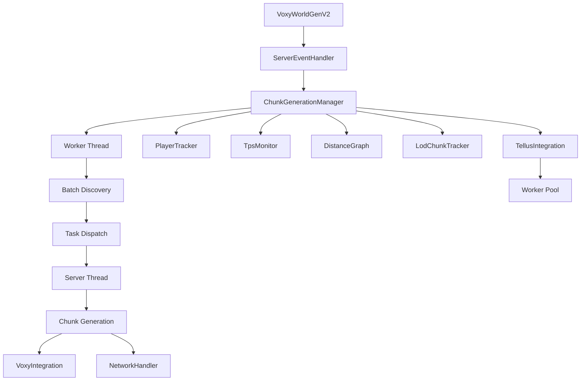

## Overview

Voxy World Gen V2 is built around a multi-threaded chunk generation system that runs alongside the Minecraft server, generating chunks asynchronously without blocking the main server thread. The architecture emphasizes performance through intelligent work distribution, TPS-aware throttling, and efficient state management.

## Core Architecture

### Worker Thread Model

The system runs a dedicated background worker thread that continuously searches for and dispatches chunk generation work:

```java
// VoxyWorldGenV2.java:141-143
workerThread = new Thread(this::workerLoop, "Voxy-WorldGen-Worker");
workerThread.setDaemon(true);
workerThread.start();
```

The worker loop operates independently:
1. Detects player positions across all dimensions
2. Finds missing chunks using the DistanceGraph
3. Acquires semaphore permits to control parallelism
4. Dispatches generation tasks to the server thread
5. Handles completion and cleanup

See [Chunk Generation](/concepts/chunk-generation) for details on the generation workflow.

### Dimension State Management

Each dimension maintains isolated state through the `DimensionState` class:

```java
// ChunkGenerationManager.java:43-56
private static class DimensionState {
    final ServerLevel level;
    final LongSet completedChunks = LongSets.synchronize(new LongOpenHashSet());
    final LongSet trackedChunks = LongSets.synchronize(new LongOpenHashSet());
    final DistanceGraph distanceGraph = new DistanceGraph();
    final Set<Long> trackedBatches = ConcurrentHashMap.newKeySet();
    final Map<Long, AtomicInteger> batchCounters = new ConcurrentHashMap<>();
    final AtomicInteger remainingInRadius = new AtomicInteger(0);
    boolean tellusActive = false;
    boolean loaded = false;
}
```

**Key state components:**
- `completedChunks` - Chunks fully generated and saved to the persistence cache
- `trackedChunks` - Chunks currently being processed (prevents duplicate work)
- `distanceGraph` - Hierarchical spatial index for efficient work discovery
- `trackedBatches` - 4x4 batch tracking to prevent concurrent batch processing
- `tellusActive` - Flag for Tellus integration (Earth-scale terrain)

### Ticket System

Voxy uses Minecraft's chunk ticket system to force-load chunks during generation:

```java
// ChunkGenerationManager.java:499-513
private void processPendingTickets() {
    TicketOp op;
    Set<ServerLevel> modifiedLevels = new HashSet<>();
    while ((op = pendingTicketOps.poll()) != null) {
        ServerChunkCache cache = op.level().getChunkSource();
        if (op.add()) {
            cache.addTicketWithRadius(TicketType.FORCED, op.pos(), 0);
        } else {
            cache.removeTicketWithRadius(TicketType.FORCED, op.pos(), 0);
        }
        modifiedLevels.add(op.level());
    }
    // ...
}
```

**Ticket operations are queued** (ChunkGenerationManager.java:82-83) and processed on the main thread to maintain compatibility with C2ME and other threading mods. Tickets are:
- Added before chunk generation starts
- Removed immediately after generation completes
- Applied in batches to minimize DistanceManager updates

## Component Relationships



### ChunkGenerationManager

Central orchestrator that:
- Manages the worker thread lifecycle
- Coordinates dimension state
- Handles player movement detection
- Controls task throttling via semaphore
- Processes ticket operations

See ChunkGenerationManager.java:40-606 for implementation.

### PlayerTracker

Tracks online players and their LOD sync state:

```java
// PlayerTracker.java:10-22
public class PlayerTracker {
    private static final PlayerTracker INSTANCE = new PlayerTracker();
    private final Set<ServerPlayer> players;
    private final Map<UUID, LongSet> syncedChunks;
}
```

Maintains:
- Active player set (ConcurrentHashMap.newKeySet())
- Per-player synced chunks (tracks which LOD data has been sent)
- Thread-safe access for worker and server threads

See PlayerTracker.java:1-51.

### NetworkHandler

Handles client-server communication for LOD data:

```java
// NetworkHandler.java:95-160
public static void broadcastLODData(LevelChunk chunk) {
    // Serializes chunk sections (blocks, biomes, light)
    // Broadcasts to players within 4096 block radius
    // Marks chunks as synced in PlayerTracker
}
```

**Network packets:**
- `HandshakePayload` - Server mod presence signal
- `LODDataPayload` - Chunk section data (states, biomes, block/sky light)

See NetworkHandler.java:1-218.

### VoxyIntegration

Dynamic integration with the Voxy mod (LOD rendering) using reflection:

```java
// VoxyIntegration.java:84-93
public static void ingestChunk(LevelChunk chunk) {
    if (!initialized) initialize();
    if (!enabled || ingestMethod == null) return;
    
    try {
        ingestMethod.invoke(chunk);
    } catch (Throwable e) {
        VoxyWorldGenV2.LOGGER.error("failed to ingest chunk", e);
    }
}
```

Provides:
- Automatic method discovery (handles API changes)
- `ingestChunk()` - Standard chunk ingestion
- `rawIngest()` - Direct section-level ingestion for Tellus

See VoxyIntegration.java:1-143.

### TellusIntegration

Optional integration for Earth-scale terrain generation (Tellus mod):

```java
// TellusIntegration.java:62-67
public static boolean isTellusWorld(ServerLevel level) {
    if (!initialized) initialize();
    if (!TellusSampler.isTellusPresent()) return false;
    Object generator = level.getChunkSource().getGenerator();
    return generator != null && generator.getClass().getName().contains("EarthChunkGenerator");
}
```

When active:
- Uses dedicated worker pool for terrain sampling
- Bypasses normal Minecraft generation
- Directly ingests voxel data into Voxy
- Supports large generation radius (128+ chunks)

See TellusIntegration.java:1-330.

## Lifecycle

### Initialization

```java
// ServerEventHandler.java:13-16
public static void onServerStarted(MinecraftServer server) {
    VoxyWorldGenV2.LOGGER.info("server started, initializing manager");
    ChunkGenerationManager.getInstance().initialize(server);
}
```

On server start:
1. Config loaded (Config.java:19-38)
2. Network handlers registered (NetworkHandler.java:86-93)
3. ChunkGenerationManager initialized
4. Worker thread started
5. Semaphore created with `maxActiveTasks` permits

### Server Tick

Every tick (ChunkGenerationManager.java:352-375):
1. Process pending ticket operations
2. Reload config if scheduled
3. Update TPS monitor
4. Update generation stats
5. Check player movement and trigger rescans
6. Broadcast chunk updates via NetworkHandler

### Shutdown

```java
// ChunkGenerationManager.java:114-137
public void shutdown() {
    running.set(false);
    stopWorker();
    TellusIntegration.shutdown();
    LodChunkTracker.getInstance().clearAll();
    
    // Save all dimension states
    for (var entry : dimensionStates.entrySet()) {
        DimensionState state = entry.getValue();
        if (state.loaded) {
            ChunkPersistence.save(state.level, entry.getKey(), state.completedChunks);
        }
    }
    // ...
}
```

On server shutdown:
1. Stop worker thread (5 second grace period)
2. Shutdown Tellus worker pool
3. Clear LOD tracker
4. Save all dimension generation progress
5. Clear all state

## Thread Safety

The system operates across multiple threads:

**Worker Thread:**
- Reads player positions from cached maps (ChunkGenerationManager.java:73-74)
- Searches DistanceGraph for work
- Acquires semaphore permits
- Queues work to server thread

**Server Thread:**
- Processes ticket operations
- Executes chunk generation
- Updates player tracking
- Broadcasts network packets

**C2ME Storage Threads:**
- Chunk save interception (ChunkSaveMixin.java:32-55)
- Thread-safe player proximity checks

**Synchronization primitives:**
- `AtomicBoolean`, `AtomicInteger`, `AtomicLong` for flags and counters
- `ConcurrentHashMap` for shared state
- `LongSets.synchronize()` for chunk position sets
- `Semaphore` for task throttling
- `synchronized` blocks for DistanceGraph updates

<Note>
The architecture carefully avoids main-thread blocking and maintains compatibility with performance mods like C2ME through deferred ticket operations and thread-safe state access.
</Note>