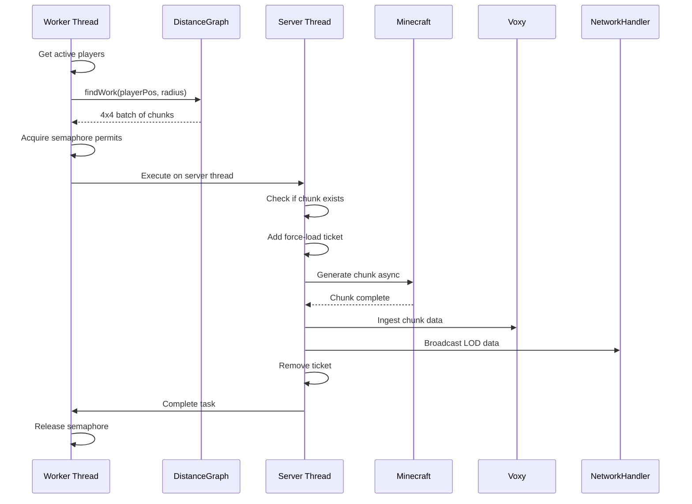

## Overview

Chunk generation in Voxy World Gen V2 operates through a continuous worker loop that discovers missing chunks, batches them for efficiency, and dispatches async generation tasks. The system prioritizes chunks by distance from players and uses sophisticated throttling to maintain server performance.

## Generation Workflow

The complete workflow from player detection to chunk completion:



## Worker Loop

The worker thread runs continuously in the background:

```java
// ChunkGenerationManager.java:160-350
private void workerLoop() {
    while (workerRunning.get() && running.get()) {
        try {
            // Check if generation is enabled and not throttled
            if (!Config.DATA.enabled || server == null) {
                Thread.sleep(100);
                continue;
            }
            
            if (tpsMonitor.isThrottled() || pauseCheck.getAsBoolean()) {
                Thread.sleep(500);
                continue;
            }
            
            // Get active players
            var players = new ArrayList<>(PlayerTracker.getInstance().getPlayers());
            if (players.isEmpty()) {
                Thread.sleep(1000);
                continue;
            }
            
            // Find work...
        } catch (InterruptedException e) {
            Thread.currentThread().interrupt();
            break;
        }
    }
}
```

### Phase 1: Player Detection

The worker iterates through all active players to find generation work:

```java
// ChunkGenerationManager.java:182-191
for (ServerPlayer player : players) {
    DimensionState ds = getOrSetupState((ServerLevel) player.level());
    int radius = ds.tellusActive 
        ? Math.max(Config.DATA.generationRadius, 128) 
        : Config.DATA.generationRadius;
    batch = ds.distanceGraph.findWork(player.chunkPosition(), radius, ds.trackedBatches);
    if (batch != null) {
        activeState = ds;
        break;
    }
}
```

**Key points:**
- Each player is checked in their current dimension
- Tellus worlds get expanded radius (minimum 128 chunks)
- First player with available work wins
- Work search stops at first batch found

### Phase 2: Batch Processing

Chunks are processed in 4x4 batches for efficiency:

```java
// ChunkGenerationManager.java:232-233
long batchKey = DistanceGraph.getBatchKey(batch.get(0).x, batch.get(0).z);
finalState.batchCounters.put(batchKey, new AtomicInteger(batch.size()));
```

**Batch coordination:**
- Prevents concurrent processing of the same batch
- Tracks completion count per batch
- Removes batch from `trackedBatches` when complete
- Batch size is always 16 chunks (4x4 grid)

### Phase 3: Task Throttling

Each chunk acquires a semaphore permit before dispatching:

```java
// ChunkGenerationManager.java:254-286
for (ChunkPos pos : preFiltered) {
    if (!workerRunning.get()) break;
    
    boolean acquired = false;
    try {
        acquired = throttle.tryAcquire(50, TimeUnit.MILLISECONDS);
    } catch (InterruptedException e) {
        Thread.currentThread().interrupt();
        break;
    }
    
    if (!acquired) break;
    
    processedCount++;
    if (finalState.trackedChunks.add(pos.toLong())) {
        activeTaskCount.incrementAndGet();
        stats.incrementQueued();
        
        if (finalState.tellusActive) {
            TellusIntegration.enqueueGenerate(finalState.level, pos, () -> {
                onSuccess(finalState, pos);
                completeTask(finalState, pos);
            });
            continue;
        }
        
        readyToGenerate.add(pos);
    } else {
        throttle.release();
        onFailure(finalState, pos);
    }
}
```

**Throttling mechanism:**
- Semaphore initialized with `Config.DATA.maxActiveTasks` permits (default: 20)
- `tryAcquire()` with 50ms timeout prevents worker blocking
- Failed acquire breaks the batch loop
- Permit released only when task completes
- Prevents memory/CPU overload

See [Performance](/concepts/performance) for throttling details.

### Phase 4: Async Generation

Work is dispatched to the server thread for actual generation:

```java
// ChunkGenerationManager.java:293-339
if (!readyToGenerate.isEmpty()) {
    server.execute(() -> {
        ServerChunkCache cache = finalState.level.getChunkSource();
        List<ChunkPos> actuallyGenerate = new ArrayList<>();
        
        // Check for existing chunks
        for (ChunkPos pos : readyToGenerate) {
            if (finalState.level.hasChunk(pos.x, pos.z)) {
                LevelChunk existingChunk = finalState.level.getChunk(pos.x, pos.z);
                if (existingChunk != null && !existingChunk.isEmpty()) {
                    VoxyIntegration.ingestChunk(existingChunk);
                    NetworkHandler.broadcastLODData(existingChunk);
                }
                onSuccess(finalState, pos);
                completeTask(finalState, pos);
            } else {
                queueTicketAdd(finalState.level, pos);
                actuallyGenerate.add(pos);
            }
        }
        
        // Apply tickets before generation
        if (!actuallyGenerate.isEmpty()) {
            processPendingTickets();
            
            for (ChunkPos pos : actuallyGenerate) {
                ((ServerChunkCacheMixin) cache)
                    .invokeGetChunkFutureMainThread(pos.x, pos.z, ChunkStatus.FULL, true)
                    .whenCompleteAsync((result, throwable) -> {
                        if (throwable == null && result != null && result.isSuccess() 
                            && result.orElse(null) instanceof LevelChunk chunk) {
                            onSuccess(finalState, pos);
                            if (!chunk.isEmpty()) {
                                if (!Config.DATA.saveNormalChunks) {
                                    LodChunkTracker tracker = LodChunkTracker.getInstance();
                                    tracker.markLod(finalState.level.dimension(), pos.toLong());
                                    ((ChunkAccessUnsavedMixin) chunk).voxyworldgen$setUnsaved(false);
                                    tracker.incrementSkipped();
                                }
                                VoxyIntegration.ingestChunk(chunk);
                                NetworkHandler.broadcastLODData(chunk);
                            }
                        } else {
                            onFailure(finalState, pos);
                        }
                        cleanupTask(finalState.level, pos);
                    }, server);
            }
        }
    });
}
```

**Generation steps:**
1. Check if chunk already exists (skip generation)
2. Queue ticket additions for new chunks
3. Process tickets immediately
4. Request chunk at `ChunkStatus.FULL`
5. Wait for async completion
6. Mark as LOD-only if `saveNormalChunks` is false
7. Ingest to Voxy for rendering
8. Broadcast to nearby players
9. Remove ticket and release permit

## Distance-Based Prioritization

The `DistanceGraph` uses a hierarchical spatial index to find work nearest to players:

```java
// DistanceGraph.java:80-141
public List<ChunkPos> findWork(ChunkPos center, int radiusChunks, Set<Long> trackedBatches) {
    int cbx = center.x >> BATCH_SIZE_SHIFT;  // Convert to batch coords
    int cbz = center.z >> BATCH_SIZE_SHIFT;
    int rb = (radiusChunks + 3) >> BATCH_SIZE_SHIFT;
    
    PriorityQueue<WorkItem> queue = new PriorityQueue<>(
        Comparator.comparingDouble(i -> i.distSq)
    );
    
    // Seed with root nodes in range
    // ...
    
    while (!queue.isEmpty()) {
        WorkItem item = queue.poll();
        if (item.node != null && item.node.isFull()) continue;
        
        if (item.level == 0) {
            // Found a batch
            long key = ChunkPos.asLong(item.x, item.z);
            if (trackedBatches.add(key)) {
                List<ChunkPos> batch = new ArrayList<>(16);
                for (int lz = 0; lz < 4; lz++) {
                    for (int lx = 0; lx < 4; lx++) {
                        batch.add(new ChunkPos((item.x << 2) + lx, (item.z << 2) + lz));
                    }
                }
                return batch;
            }
            continue;
        }
        
        // Expand children
        int childLevel = item.level - 1;
        int childSize = 1 << (3 * childLevel);
        
        for (int i = 0; i < 64; i++) {
            if (item.node != null && (item.node.fullMask & (1L << i)) != 0) continue;
            
            int cx = (item.x << 3) + (i & 7);
            int cz = (item.z << 3) + (i >> 3);
            
            double dSq = getDistSq(cx, cz, childSize, cbx, cbz);
            if (dSq <= (double)rb * rb) {
                Object child = (item.node == null) ? null : item.node.children.get(i);
                Node childNode = (child instanceof Node) ? (Node) child : null;
                queue.add(new WorkItem(childNode, childLevel, cx, cz, dSq));
            }
        }
    }
    return null;
}
```

**Hierarchy levels:**
- L3: 2048x2048 chunks (root entry point)
- L2: 256x256 chunks
- L1: 32x32 chunks
- L0: 4x4 chunks (batch level)

**Priority queue ordering:**
- Items sorted by `distSq` (distance squared to player)
- Nearest incomplete batch wins
- Creates circular generation pattern around players

See DistanceGraph.java:1-331 for implementation.

## LOD-Only vs Normal Chunks

Chunks are classified based on how they're accessed:

### Normal Chunks

Chunks loaded by players through normal view distance:
- Always saved to disk
- Generate terrain features, entities, structures
- Remain loaded while players are nearby
- Unaffected by `saveNormalChunks` config

### LOD-Only Chunks

Chunks generated purely for distant LOD rendering:

```java
// ChunkGenerationManager.java:323-328
if (!Config.DATA.saveNormalChunks) {
    LodChunkTracker tracker = LodChunkTracker.getInstance();
    tracker.markLod(finalState.level.dimension(), pos.toLong());
    ((ChunkAccessUnsavedMixin) chunk).voxyworldgen$setUnsaved(false);
    tracker.incrementSkipped();
}
```

**When `saveNormalChunks` is false:**
- Chunks marked as LOD-only in `LodChunkTracker`
- `setUnsaved(false)` clears dirty flag
- Save operation intercepted by `ChunkSaveMixin`
- Chunk not written to disk unless player visits

See [LOD System](/concepts/lod-system) for details.

## Player Movement Detection

The system rescans when players move significantly:

```java
// ChunkGenerationManager.java:377-437
private void checkPlayerMovement() {
    boolean shouldRescan = false;
    
    for (ServerPlayer player : players) {
        UUID playerId = player.getUUID();
        ChunkPos currentPos = player.chunkPosition();
        ChunkPos lastPos = lastPlayerPositions.get(playerId);
        ResourceKey<Level> currentDim = player.level().dimension();
        ResourceKey<Level> lastDim = lastPlayerDimensions.get(playerId);
        
        boolean dimensionChanged = lastDim != null && !lastDim.equals(currentDim);
        boolean chunkChanged = lastPos == null || !lastPos.equals(currentPos);
        
        if (chunkChanged || dimensionChanged) {
            lastPlayerPositions.put(playerId, currentPos);
            lastPlayerDimensions.put(playerId, currentDim);
        }
        
        // Rescan if moved 2+ chunks (distance squared >= 4)
        if (lastPos == null || dimensionChanged || distSq(lastPos, currentPos) >= 4) {
            shouldRescan = true;
        }
    }
    
    if (shouldRescan) {
        restartScan();
    }
}
```

**Rescan triggers:**
- Player joins (no last position)
- Dimension change
- Movement of 2+ chunks (Euclidean distance)
- Player disconnect

**Rescan operation:**
```java
// ChunkGenerationManager.java:475-488
private void restartScan() {
    var players = PlayerTracker.getInstance().getPlayers();
    if (players.isEmpty()) return;
    
    Map<DimensionState, Integer> maxCounts = new HashMap<>();
    for (ServerPlayer player : players) {
        DimensionState state = getOrSetupState((ServerLevel) player.level());
        int radius = state.tellusActive 
            ? Math.max(Config.DATA.generationRadius, 128) 
            : Config.DATA.generationRadius;
        int missing = state.distanceGraph.countMissingInRange(player.chunkPosition(), radius);
        maxCounts.merge(state, missing, Math::max);
    }
    
    maxCounts.forEach((state, count) -> state.remainingInRadius.set(count));
}
```

Recalculates `remainingInRadius` for all active dimensions, updating progress tracking.

## LOD Data Synchronization

When no generation work is available, the worker syncs completed chunks to players:

```java
// ChunkGenerationManager.java:194-229
if (batch == null) {
    boolean workDispatched = false;
    for (ServerPlayer player : players) {
        var synced = PlayerTracker.getInstance().getSyncedChunks(player.getUUID());
        if (synced == null) continue;
        
        DimensionState ds = getOrSetupState((ServerLevel) player.level());
        int radius = ds.tellusActive 
            ? Math.max(Config.DATA.generationRadius, 128) 
            : Config.DATA.generationRadius;
        List<ChunkPos> syncBatch = new ArrayList<>();
        ds.distanceGraph.collectCompletedInRange(
            player.chunkPosition(), radius, synced, syncBatch, 64
        );
        
        if (!syncBatch.isEmpty()) {
            workDispatched = true;
            server.execute(() -> {
                ServerPlayer p = server.getPlayerList().getPlayer(playerUUID);
                if (p != null) {
                    for (ChunkPos syncPos : syncBatch) {
                        LevelChunk c = level.getChunkSource().getChunk(syncPos.x, syncPos.z, false);
                        if (c != null) {
                            NetworkHandler.sendLODData(p, c);
                        }
                    }
                }
            });
            break;
        }
    }
    
    if (workDispatched) continue;
    
    Thread.sleep(100);
    continue;
}
```

This ensures players who join late receive LOD data for chunks generated before they connected.

<Warning>
The worker thread never blocks the server thread. All chunk generation and network operations are dispatched to the server thread via `server.execute()` to maintain thread safety.
</Warning>

## Tellus Fast Path

Tellus worlds (Earth-scale terrain) use a specialized generation path:

```java
// ChunkGenerationManager.java:273-278
if (finalState.tellusActive) {
    TellusIntegration.enqueueGenerate(finalState.level, pos, () -> {
        onSuccess(finalState, pos);
        completeTask(finalState, pos);
    });
    continue;
}
```

Instead of Minecraft generation:
1. Work queued to Tellus worker pool
2. Terrain sampled from Earth data
3. Voxel data built directly
4. Ingested to Voxy without Minecraft chunks
5. Completion callback releases permit

See TellusIntegration.java:69-86 and TellusIntegration.java:113-328.